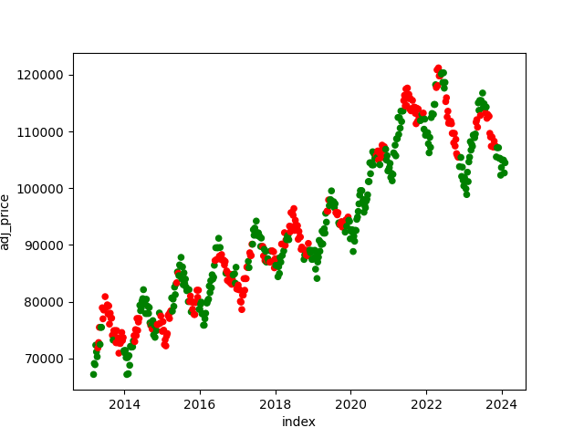
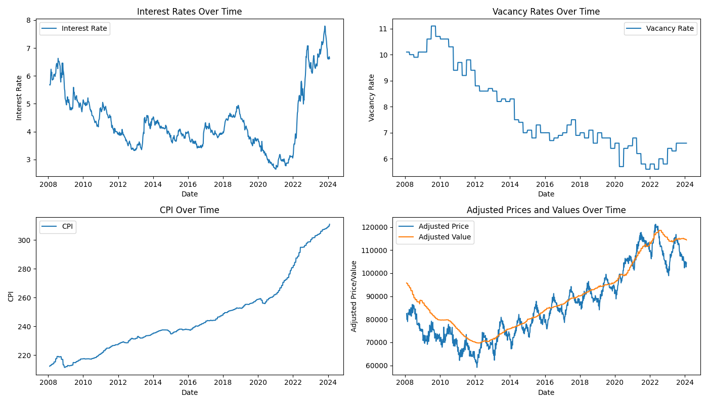
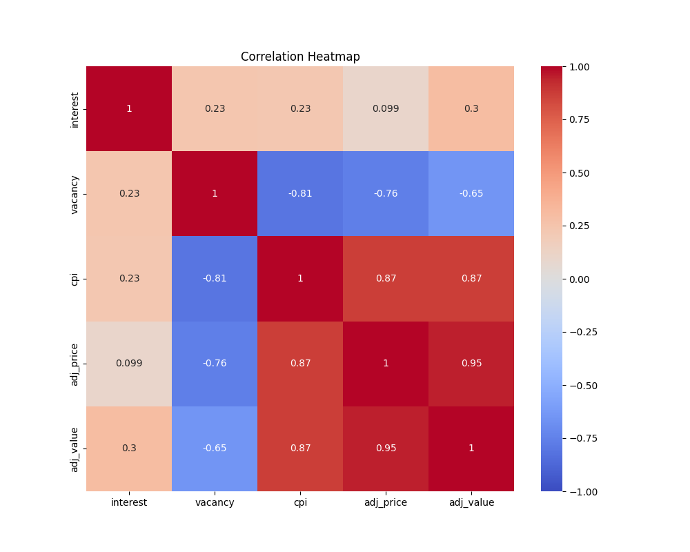
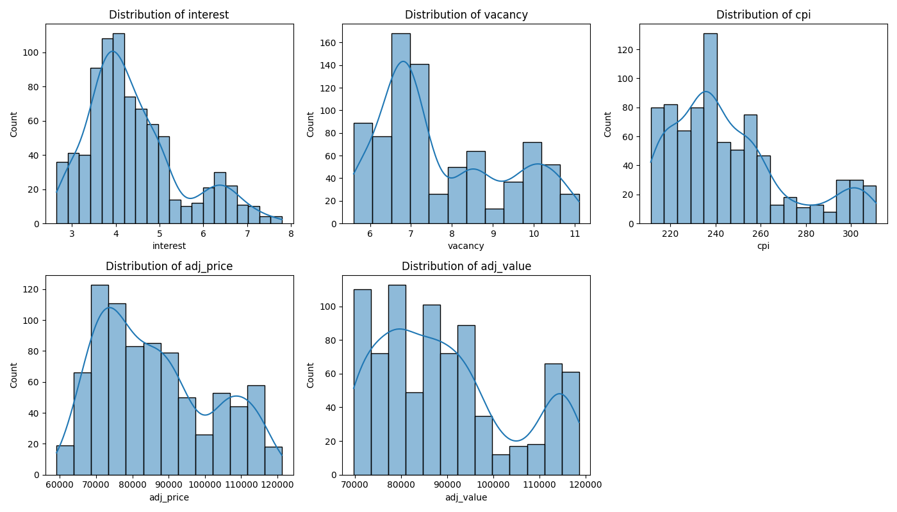
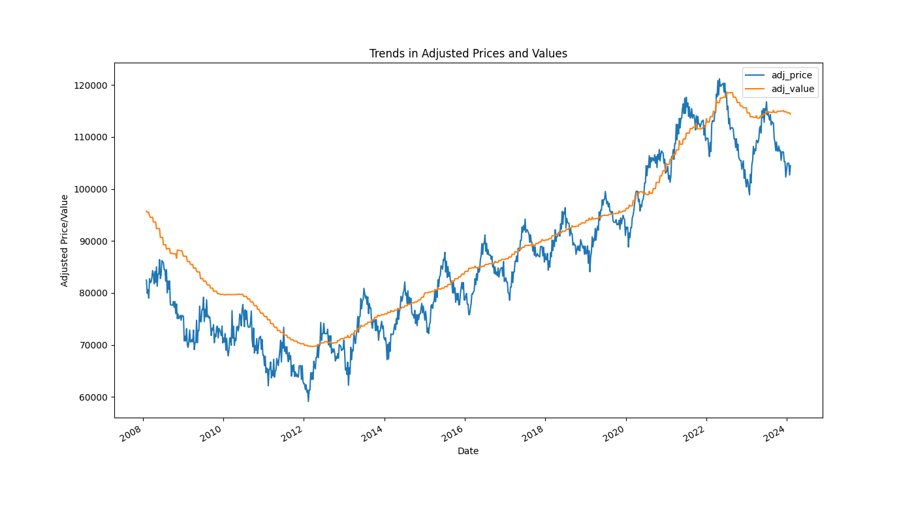
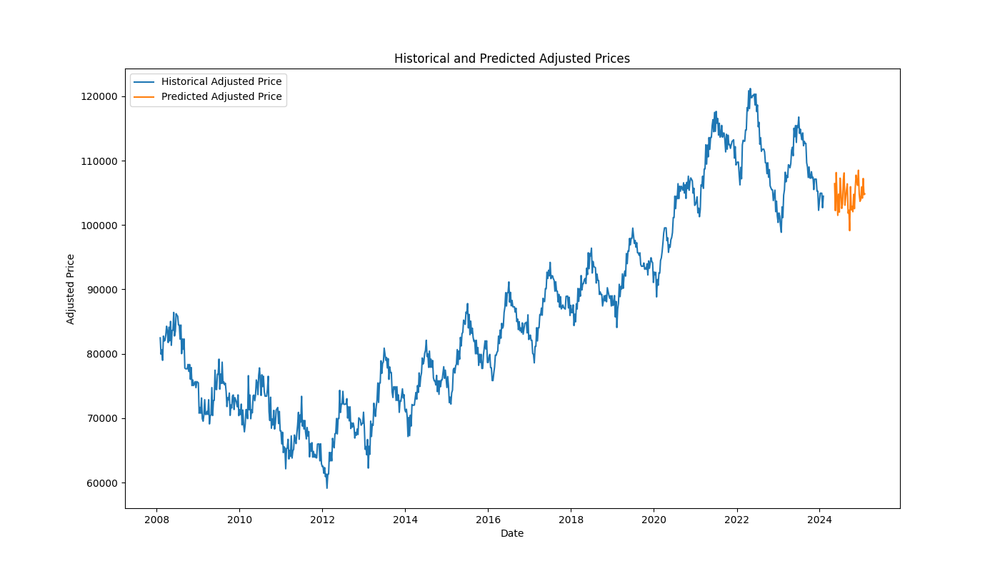
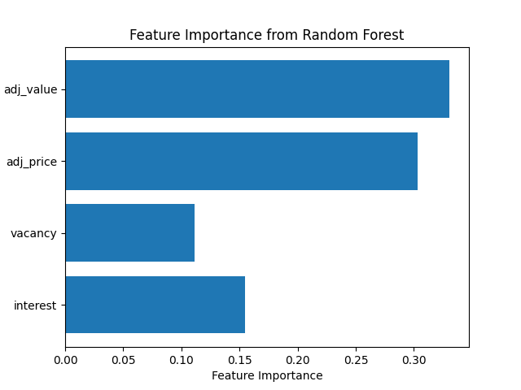

# HouseMarketAnalysis
This project involves the training of machine learning models to predict housing market trends and the analysis of their predictions. The workflow is split into two Python scripts: modelTraining.py and graphAnalysis.py.

## modelTraining.py
### Overview
The modelTraining.py script performs data loading, preprocessing, and training of several machine learning models. It evaluates the models' performances and saves the results for further analysis.

### Detailed Breakdown
#### Data Loading and Preprocessing:
* The script begins by loading and preprocessing data from various CSV files.
* Three datasets related to economic indicators (MORTGAGE30US.csv, RRVRUSQ156N.csv, and CPIAUCSL.csv) are loaded and merged into a single DataFrame (fedData).
* Two datasets related to housing prices (Metro_median_sale_price_uc_sfrcondo_week.csv and Metro_zhvi_uc_sfrcondo_tier_0.33_0.67_sm_sa_month.csv) are loaded, processed, and merged into another DataFrame (priceData).
* The combined DataFrame (combinedData) includes economic indicators and adjusted housing prices and values. The script also computes the change in adjusted price for the next quarter.
#### Feature Engineering:
* Additional features are generated, including yearly ratios for selected features (interest, vacancy, adj_price, and adj_value).

#### Model Training and Backtesting:
* Several models (RandomForestClassifier, LogisticRegression, GradientBoostingClassifier) are trained and backtested to evaluate their predictive accuracy.
* A custom backtesting function backtest is defined to iteratively train the models on historical data and predict future changes.

#### Feature Importance and Hyperparameter Tuning:

* Feature importance is assessed using permutation importance for the RandomForest model.
* GridSearchCV is used to perform hyperparameter tuning on the RandomForest model to find the best parameters for prediction accuracy.
#### Saving Results:

* The script saves the combined data, predictions, and feature importances for further analysis.
#### Key Outputs
* Initial Model Accuracy (Random Forest): Displays the accuracy of the initial RandomForest model.
* Model Accuracy with Price Trend Ratios: Shows the accuracy of models with added yearly ratios.
* Feature Importances: Prints the feature importances derived from the RandomForest model.
* Best Parameters: Displays the best parameters found through GridSearchCV.
* Best Model Accuracy: Shows the accuracy of the best model found through hyperparameter tuning.
## graphAnalysis.py
### Overview
The graphAnalysis.py script visualizes the data and predictions made by the models in modelTraining.py. It generates various plots to understand the relationships and trends in the data.

### Detailed Breakdown
#### Data Loading:

The script loads the combined data, predictions, and feature importances from the files saved by modelTraining.py.
#### Prediction Visualization:

* A scatter plot is created to visualize the accuracy of the model's predictions over time.

* Time Series Plots: Multiple subplots visualize the trends over time for interest rates, vacancy rates, CPI, adjusted prices, and adjusted values.

* Correlation Heatmap: A heatmap is generated to show the correlation between different features in the dataset.

* Distribution Plots: Histograms with KDE (Kernel Density Estimate) are plotted for each feature to show their distributions.

* Trend Analysis: A plot showing trends in adjusted prices and values over time is created.

* Future Predictions: The script trains a RandomForest model for future predictions and generates future data. Predictions for future adjusted prices are made and plotted alongside historical data.

* Feature Importance Plot: A horizontal bar plot displays the importance of each feature as determined by the RandomForest model.

#### Summary of Findings
##### Model Performance:

* The initial RandomForest model provided a baseline accuracy. Incorporating yearly ratios improved the model's performance.
* Logistic Regression and Gradient Boosting models also showed significant accuracy, with RandomForest generally performing better.
Feature Importance:

* Features such as adjusted prices, interest rates, and vacancy rates were found to be important predictors for housing market trends.
Future Predictions:

The model successfully generated future predictions for adjusted prices, highlighting potential trends.

##### Areas for Improvement
* Data Quality: Ensuring the data is up-to-date and covers a comprehensive range of features could improve model accuracy.
Feature Engineering:
* Additional features or more sophisticated feature engineering techniques could be explored to capture more complex relationships.
Model Evaluation:
* Incorporating additional evaluation metrics (e.g., precision, recall, F1-score) would provide a more holistic view of model performance.
Hyperparameter Tuning:
* More extensive hyperparameter tuning with a wider range of parameters and models could further enhance performance.
* Handling Non-Stationarity: Techniques to handle non-stationary data, such as differencing or seasonal decomposition, might improve the models' ability to predict future trends.

This project demonstrates a systematic approach to building and evaluating machine learning models for housing market prediction, providing valuable insights into the relationships between economic indicators and housing prices.
